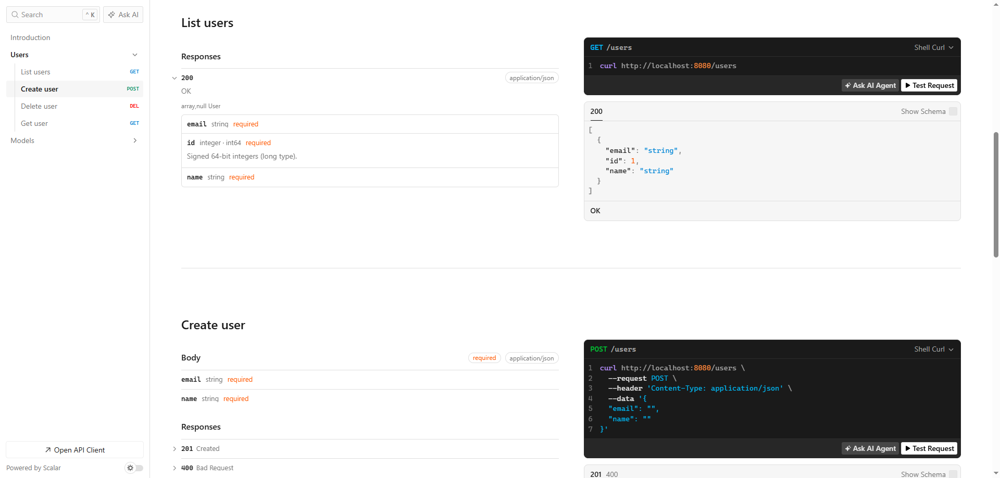

# ginopenapi

参照 Huma 为 Gin 补充 OpenAPI/OpenAPI 文档层 —— **Gin 是真正的 Router，本库只做 OpenAPI/Schema 文档**。

它不会接管任何 HTTP 请求：不注册 Huma handler、不修改 Gin middleware、不改动等已有的路由。你已有的 Gin 代码一行都不用改，只需要在启动时加上一层描述。



## 设计原则

- **Gin 管一切请求**，`ginopenapi` 只在「元数据层」工作。
- **Huma 只当 OpenAPI/Schema Engine**：把 `Operation` 转成 Huma 的 OpenAPI 对象，用 Huma 的 registry 生成 JSON Schema（`$ref` 进 `components/schemas`）。
- 你已有的 `r.GET("/users/:id", GetUser)` 原样保留，`Scan()` 自动发现它。
- 文档自曝路径（`/openapi.json`、`/openapi.yaml`、`/docs`、`/docs/scalar.js`）会自动从文档里排除，不会「自己描述自己」。

## 作为依赖引入（SDK 用法）

模块发布地址为 `github.com/lsy88/ginopenapi`，可作为普通依赖直接拉取。

**方式一：直接拉取（推荐）。**

```bash
go get github.com/lsy88/ginopenapi@latest
```

```go
import "github.com/lsy88/ginopenapi"
```

> 依赖名与包名一致，import 路径即 `github.com/lsy88/ginopenapi`。

**方式二：本地多模块开发。** 在本仓库内联调（或 fork 后调试）时，用 `replace` 指向本地目录：

```go
require (
    github.com/lsy88/ginopenapi v0.0.0
    github.com/gin-gonic/gin v1.12.0
)

replace github.com/lsy88/ginopenapi => ../ginopenapi   // 或你实际的相对/绝对路径
```

**前置要求**：Go 1.25+；`ginopenapi` 会传递拉取 `github.com/danielgtaylor/huma/v2`（仅用作 OpenAPI/Schema 引擎）。Scalar 文档脚本已用 `go:embed` 内置进二进制，运行无需任何外部 CDN/网络。

## 快速开始

```go
package main

import (
    "net/http"

    "github.com/gin-gonic/gin"

    "github.com/lsy88/ginopenapi"
)

type User struct {
    ID    int    `json:"id"`
    Name  string `json:"name"`
    Email string `json:"email"`
}

func GetUser(c *gin.Context) {
    id, _ := strconv.Atoi(c.Param("id"))
    c.JSON(http.StatusOK, User{ID: id, Name: "alice", Email: "a@example.com"})
}

func main() {
    r := gin.Default()

    // 1. 原来的 Gin 路由，不改动
    r.GET("/users/:id", GetUser)

    // 2. 创建文档层
    api := ginopenapi.New(
        r,
        ginopenapi.WithTitle("User Service"),
        ginopenapi.WithVersion("1.0.0"),
    )

    // 3. 扫描已注册路由
    api.Scan()

    // 4. 补充元数据（请求/响应 schema、summary 等）
    api.DescribeRoute(
        http.MethodGet, "/users/:id",
        ginopenapi.Summary("Get user"),
        ginopenapi.PathParam("id", int(0)),
        ginopenapi.Response(http.StatusOK, User{}),
    )

    // 5. 挂文档端点
    api.Serve()

    r.Run(":8080")
}
```

启动后：
- `GET /openapi.json` · OpenAPI 3.1 文档
- `GET /openapi.yaml`
- `GET /docs` · Scalar 文档 UI（脚本已用 `go:embed` 内置进二进制，无需 CDN）

## 核心流程

1. `New(r, opts...)` —— 绑定 engine + 配置 OpenAPI。
2. `Scan()` 或 `Refresh()` —— 遍历 `engine.Routes()`，把每条路由转成 OpenAPI operation（自动推导 method / path / 路径参数 / operationID），生成顺序稳定。
3. `Describe` / `DescribeRoute` —— 给指定路由补充 summary / tags / 请求体 / 响应 schema。
4. `Serve()` —— 注册 `/openapi.json`、`/openapi.yaml`、`/docs`（含内置 Scalar JS）。

## 描述 DSL

### 按路由补充元数据

```go
api.DescribeRoute(
    http.MethodPost, "/users",
    ginopenapi.Summary("Create user"),
    ginopenapi.Tags("Users"),
    ginopenapi.Body(CreateUserRequest{}),                    // 请求体
    ginopenapi.Response(http.StatusCreated, User{}),         // 成功响应
    ginopenapi.Response(http.StatusBadRequest, Error{}),     // 错误响应
)
```

已存在的 handler 也可以按函数查找（内部用 `reflect.ValueOf(handler).Pointer()` 关联）：

```go
api.Describe(
    CreateUser,                       // 已注册的 handler 函数
    ginopenapi.Summary("Create user"),
    ginopenapi.Body(CreateUserRequest{}),
)
```

> 同一个 handler 被注册到多条路由时，`Describe` 只会命中第一条；这种情况请用 `DescribeRoute`。

### Option 一览

| 分类 | 函数 |
|---|---|
| 基础 | `OperationID(id)`, `Summary(s)`, `Description(d)`, `Tags(...)`, `Deprecated()`, `Hidden()` |
| 参数 | `Param(name, in, typ)`, `PathParam(name, typ)`, `QueryParam(name, typ)`, `HeaderParam(name, typ)`, `CookieParam(name, typ)` |
| 请求体 | `Body(struct{})`, `BodyOptional(struct{})`, `ContentType(t)` |
| 响应 | `Response(status, body)`, `ResponseDescription(status, d)`, `ResponseContentType(status, t)`, `ResponseHeader(status, name, HeaderSpec{})` |

- `Body` / `Response` 的 `typ` 传**值**（`User{}` / `[]User{}` / 指针均可），内部用 `reflect.TypeOf` 生成 schema。
- 未显式声明的路径参数会自动补齐（string、required）。
- 若某个路由没有任何 `Response`，会补一个描述为 `OK` 的 `200`。
- `Hidden()` 隐藏的路由在 Gin 中照常工作，但不会出现在文档里。

### 初始化 Option

| 函数 | 说明 |
|---|---|
| `WithTitle / WithVersion / WithDescription` | 文档标题、版本、描述 |
| `WithServer(url)` | 追加一个 server |
| `WithOpenAPI(openapi)` | 用自建的 `*huma.OpenAPI`（会补默认 registry） |
| `WithSkipPaths(paths...)` | 按 Gin 原始路径排除路由，支持 glob（`path.Match` 规则，如 `/favicon*`） |
| `WithSkipRoute(fn)` | 自定义谓词排除，多个会叠加 |

`WithSkipPaths` 匹配的是 **Gin 路由的原始路径**，注意静态资源：

```go
r.Static("/assets", "./web/dist/assets")     // 注册为 GET/HEAD /assets/*filepath
r.StaticFile("/favicon.ico", "./favicon.ico")
r.StaticFile("/icon.png", "./icon.png")

ginopenapi.New(r,
    ginopenapi.WithSkipPaths("/assets/*filepath", "/favicon*", "/icon*"),
)
```

### Serve Option

`api.Serve()` 默认挂 `/openapi.json`、`/openapi.yaml`、`/docs`、`/docs/scalar.js`，可用
`WithJSONPath / WithYAMLPath / WithDocsPath / WithDocsJSPath` 自定义（传空字符串禁用对应端点）。

## 线程安全

`Scan / Refresh / Describe / DescribeRoute` 持有写锁，`/openapi.json`、`/openapi.yaml`、`/docs` 的渲染持有读锁。运行期可安全 `Refresh()` 热重载。

## 关于请求/响应的 schema 类型

Gin 的 handler 是 **`func(*gin.Context)`**，函数体内 `c.JSON(200, User{})` 的 `User` 类型**运行时反射拿不到**。因此纯运行时本库只能自动推导 method / path / 路径参数；**请求体、响应 schema 需要你显式声明**。

如果接口很多、不想手写，用配套工具 [`ginopenapi-gen`](tools/ginopenapi-gen/README.md)：它用 `go/types` 静态分析 handler 函数体（`c.ShouldBindJSON` / `c.JSON`），自动生成 `DescribeRoute` 调用。